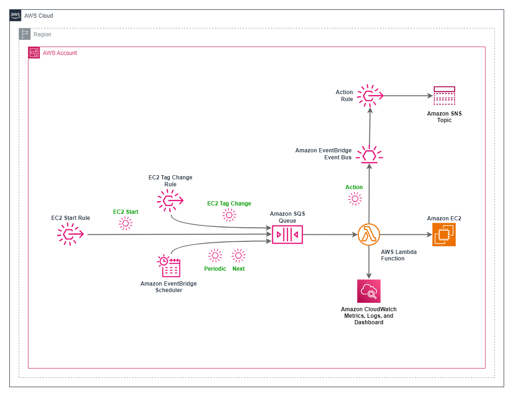

# Guidance for EC2 Instance Expiration on AWS

## Table of Contents

1. [Overview](#overview)
2. [Features](#features)
3. [Deployment](#deployment)
4. [Usage](#usage)
5. [Design](#design)
6. [Costs](#costs)
7. [Issues](#issues)
8. [Next Steps](#events)
9. [Cleanup](#cleanup)
10. [Notices](#notices)

## Overview

Stops (or terminates) EC2 instances that have run (or existed) past the expiration values defined in their tags.

For example, the `expiration:stop-after-duration` tag could be used to stop the instance `1d2h` after its launch
date/time. Or, the `expiration:terminate-after-datetime` tag could be used to terminate the instance as of
`2024-03-15 12:00:00 UTC`.

Example use cases:

- Preset temporary EC2 instances to automatically terminate after a specified duration.
- Auto-stop an occasionally-used operations EC2 instance every time it is running for more than 1 day.
- Prevent ephemeral EC2 instances (ex: build agent machines) from existing beyond their expected use.
- Terminate an EC2 instance that has failed to continuously reset its own expiration tag 1 hour into the future.

> :warning: **Warning:** With this guidance deployed and enabled it becomes possible to stop or terminate an EC2
> instance via editing its expiration tags. I.e., anybody (or anything) that can create or modify an expiration tag
> could abuse that permission to effectively stop or terminate the instance. See [Risks](#risks) for
> important considerations and mitigation.
 
## Features

**Relative and Absolute Tags** - The tag values can be relative to an EC2 instance's launch time (easier in some cases
because an automation does not need to calculate a future date) or an absolute date/time value.

**Event Driven** - The guidance monitors EC2 instance tags and schedules required stop/terminate actions using the
Amazon EventBridge Scheduler. This provides better precision (actions are very close to their schedule times) and
is more efficient than polling.

**Custom Tag Prefix** - The default `expiration:` tag prefix can be replaced with a custom value.

**Events** - Events for expiration actions are emitted to an Amazon EventBridge Event Bus for optional
integration/automation.

**Notifications** - If an SNS Topic is specified it will receive events for expiration actions, for example enabling
administrators to subscribe for notifications.

**CloudWatch Dashboard** - An optional CloudWatch Dashboard provides metrics, insights, and logs for the guidance.

## Deployment

The guidance is provided is an app based on the [AWS Cloud Development Kit (CDK)](https://aws.amazon.com/cdk/),
which is a free infrastructure-as-code platform. One runs the app to generate an
[AWS CloudFormation](https://aws.amazon.com/cloudformation/) template that is then deployed to an AWS account. This
results in a set of resources (Amazon EventBridge Scheduler, AWS Lambda, etc.) that implements the guidance.
Experience with the AWS CDK is **not** required.

### Prerequisite: AWS Cloud Development Kit

Python and the AWS CDK are required to build the guidance. Choose one of the following paths:

#### 1) Use the AWS CloudShell

The [AWS CloudShell](https://aws.amazon.com/cloudshell/) has all the prerequisites for building and deploying AWS CDK
apps like this guidance and is available with one-click in the AWS Management Console. This makes it fast
and easy to deploy the guidance. See
[How to get started with the AWS CloudShell](https://docs.aws.amazon.com/cloudshell/latest/userguide/welcome.html#how-to-get-started)
for screenshots of how to open the AWS CloudShell.

#### 2) Use an Existing AWS CDK Setup

Optionally review
[AWS Cloud Development Kit (CDK) Guide \ Getting Started](https://docs.aws.amazon.com/cdk/v2/guide/getting_started.html)
to confirm your existing AWS CDK environment.

#### 3) Create a New AWS CDK Setup

See [AWS Cloud Development Kit (CDK) Guide \ Getting Started](https://docs.aws.amazon.com/cdk/v2/guide/getting_started.html) for instructions.

The typical general steps:

1. Install Node.js
2. Install Python
3. Install and setup the AWS CLI
4. Install AWS CDK

#### CDK Version

Your AWS CDK command line interface (CLI) must be sufficiently up-to-date. Especially if using the AWS CloudShell,
execute the following command to update your AWS CDK CLI:

Windows:
```
npm install -g aws-cdk
```

Linux (including AWS CloudShell):
```
sudo npm install -g aws-cdk
```

#### CDK Bootstrap

In all cases and as with any AWS CDK app, the AWS account in which to deploy the guidance must be bootstrapped for use
with the AWS CDK. If your account has never been bootstrapped, execute the following command (note that duplicate
bootstrapping of an account is safe):

```
cdk bootstrap aws://ACCOUNT-ID/REGION-ID
```

Your ACCOUNT-ID is a 12-digit number and can be
[found in the account drop-down in the upper-right of the AWS Management Console](https://docs.aws.amazon.com/accounts/latest/reference/manage-acct-identifiers.html#FindAccountId)
or by executing this command:

```
aws sts get-caller-identity
```

Your REGION-ID can be
[found in the region drop-down in the upper right of the AWS Management Console](https://docs.aws.amazon.com/awsconsolehelpdocs/latest/gsg/select-region.html)
or by inspecting an AWS CloudShell environment variable:

```
echo $AWS_REGION
```

Here is an example bootstrap command:

```
cdk bootstrap aws://123456789012/us-east-1
```

### Clone the Repository

Use a Git client to clone the repo:

```
git clone https://github.com/aws-solutions-library-samples/guidance-for-instance-expiration-on-aws.git
```

Alternatively, download the repo contents manually to a local folder:

* https://github.com/aws-solutions-library-samples/guidance-for-instance-expiration-on-aws

### Build the App

Optionally create and activate a [Python virtual environment](https://docs.python.org/3/library/venv.html) for the
project to isolate it from the machine's general Python environment:

```
cd guidance-for-instance-expiration-on-aws
python -m venv .venv
source .venv/bin/activate
```

Install the app's Python dependencies:

```
pip install -r requirements.txt
```

Use the typical CDK command to build and deploy the app.

```
cdk deploy
```

Several CloudFormation parameters can be supplied on the deploy command line:

| Name              | Values             | Default    | Purpose                                                     |
|-------------------|--------------------|------------|-------------------------------------------------------------|
| TagPrefix         | String             | expiration | Prefix for the EC2 instance tags inspected.                 |
| StopAction        | Enable \| Disable  | Enable     | Enable or disable stopping EC2 instances.                   |
| TerminateAction   | Enable \| Disable  | Enable     | Enable or disable terminating EC2 instances.                |
| BackupCheckPeriod | Integer (minutes)  | 60         | Period for backup expiration check invocations, in minutes. |
| EventBusName      | String             | default    | Name of existing EventBridge bus for action events.         |
| SnsTopicName      | String             |            | Name of existing SNS Topic for action event notifications.  |
| CloudWatch        | Enable \| Disable  | Disable    | Enable or disable CloudWatch dashboard.                     |

Note that `SnsTopicName` only takes effect if `EventBusName` is not empty because notifications via an SNS Topic
depend upon action events via an Event Bus.

Example command line to deploy the app with some parameter values specified:

```
cdk deploy \
  --parameters TagPrefix=acme:it:expiration \
  --parameters SnsTopicName=ops-alerts
```

### Inspect Deployment

Like all AWS CDK deployed apps, the result is an AWS CloudFormation stack.

One can view the resulting stack within the AWS CloudFormation service in the AWS Management Console, including its
resources and outputs. The default stack name is **InstanceExpiration**.

### Cleanup

Use the following CDK command to remove the deployed guidance:

```
cdk destroy
```

## Usage

Once deployed, one need only set expiration tags on EC2 instances as desired.

### Expiration Tags

|                                         |                                                                             |
|-----------------------------------------|-----------------------------------------------------------------------------|
| **expiration:stop-after-duration**      | **Stop** the instance after a **duration** since its launch date/time.      |
| **expiration:stop-after-datetime**      | **Stop** the instance at an absolute **date/time**.                         |
| **expiration:terminate-after-duration** | **Terminate** the instance after a **duration** since its launch date/time. |
| **expiration:terminate-after-datetime** | **Terminate** the instance at an absolute **date/time**.                    |

> :memo: **Note:** The EC2 service defines an EC2 instance's "launch date/time" from the *last time* it was started -
> not from when it was created or started for the first time. (This behavior is not specific to this guidance.)
> A misunderstanding of this EC2 instance attribute can lead to unexpected behavior. For example, every time
> an instance with the **expiration:stop-after-duration** tag is started it becomes eligible once again to be stopped by
> the guidance.

#### Duration Tag Format

`[#d][#h][#m][#s]`

The days, hours, minutes, and seconds fields are each optional and each prefixed with an integer.

Examples:

* 1d2h3m4s
* 10d14h
* 24h
* 10d

#### Date/Time Tag Format

`YYYY-MM-DD HH:MM:SS UTC`

All fields (year, month, day, hours, minutes, seconds) are required and must be zero-padded to the length specified
by the format above. The `UTC` timezone designation is required (other timezones are not supported).

### Events

If the `EventBusName` CloudFormation template parameter value set during deployment refers to a valid Event Bus then
the guidance will emit events for actions taken (stopping or terminating EC2 instances). Also, an Event
Bus Rule will be created for these events. One may add targets to the rule, or use it as a reference for creating other
rules.

Example event:

```yaml
{
  "version": "0",
  "id": "6a7e8feb-b491-4cf7-a9f1-bf3703467718",
  "time": "2024-02-03T18:43:48Z",
  "account": "111122223333",
  "region": "us-east-1",
  "source": "InstanceExpiration",
  "detail-type": "Action",
  "detail":
  {
    "action": "STOP",
    "instance-id": "i-1234567890abcdef0",
  } 
}
```

### Notifications

If the `SnSTopicName` CloudFormation template parameter value set during deployment refers to a valid SNS Topic then
it will be added as a target to the Event Bus Rule, and any subscriptions to the SNS Topic will receive notifications
about expiration actions. For example, an administrator may subscribe their email address to the SNS Topic.

```
From:
    AWS Notifications <no-reply@sns.amazonaws.com>
	
Subject:
    AWS Notification Message
	
Body:
    "Action was taken on an expired EC2 instance."
		
    "When: 2024-07-02T21:43:57Z"
    "Account: 111122223333"
    "Region: us-east-1"
    "Stack: InstanceExpiration"
    "Action: STOP"
    "Instance: i-1234567890abcdef0"
```

### Scope

#### Accounts

This guidance presently only acts within the AWS **account** in which it is deployed. No provisions are provided for use
across multiple accounts. One can deploy the guidance independently in multiple accounts.

#### Regions

This guidance presently only acts within the AWS **region** in which it is deployed. No provisions are provided for use
across multiple regions. One can deploy the guidance independently in multiple regions (even within the same account).

### Risks

#### Privilege Escalation

> :warning: **Warning:** With this guidance deployed and enabled it becomes possible to stop or terminate an EC2
> instance via editing its expiration tags. I.e., anybody (or anything) that can create or modify an expiration tag
> could abuse that permission to effectively stop or terminate the instance.

Note this is not a concern entirely unique to ths guidance. Tags are commonly, but not universally, used in access
control and automations. However, it is notable enough to warrant consideration.

##### Case #1: Identities allowed to stop/terminate EC2 instances

Any IAM identity (IAM user or role) that are already allowed to stop/terminate EC2 instances cannot gain any advantage
via this guidance and are **not** a concern for privilege escalation.

##### Case #2: Identities not allowed to create or edit EC2 instance tags

Any identities that cannot create or edit EC2 instance tags cannot gain any advantage via this guidance and are **not**
a concern for privilege escalation.

##### Case #3: Identities allowed to create and edit EC2 instance tags but not otherwise stop/terminate EC2 instances

This is the case of concern for privilege escalation. With this guidance deployed and enabled such an identity could use
its ability to create or edit an EC2 instance's tag to cause the EC2 instance to be stopped or terminated.

The CloudFormation stack created by this guidance creates a Managed IAM Policy that denies creation and editing (and
deletion) of expiration tags. For environments where this risk is a concern, one can attach this policy to identities
as-desired to mitigate this risk. The Managed IAM Policy is **not** automatically attached - an administrator must take
this step after deploying the guidance. This policy can be found listed as one of the resources created by the stack and
also in the IAM service area of the AWS Management Console, and its default name starts with
`InstanceExpiration-DenyEc2ExpirationTagChanges`.

### Troubleshooting

Use the following as desired to look deeper into the guidance operation.

#### Lambda Log

An AWS Lambda function runs in response to Amazon EventBridge Scheduler events and when EC2 instance `expiration:` tags
are modified. The log for the Lambda function is viewable within the Amazon CloudWatch service in the AWS Management
Console:

1. View the **Logs \ Log Groups** area of CloudWatch
2. Select the log group with name starting with **/aws/lambda/InstanceExpiration-Lambda**.

## Design

This section describes the design of the guidance for interested parties, which is not necessary to deploy (see
[DEPLOYMENT](#deployment)) or use (see [USAGE](#usage)) the guidance.

### Reference Architecture

[](instance-expiration-design.png)

### Lambda Function

The core of the guidance is an AWS Lambda function, which upon invocation:

1. Scans EC2 instances (metadata only).
    * Filtering to only instances with at least one expiration tag.
2. Sorts EC2 instance list by next expiration action date/time.
    * Soonest first.
3. Handles expired instances.
    * Those with an expiration action date/time <= now.
    * Stopping or terminating, as appropriate.
4. Schedules the next invocation.
    * Based on the first instance in the sorted list with expiration action date/time > now.

Note that there is **not** a schedule for each EC2 instance with an expiration tag. There is only ever a single schedule
for the **next** EC2 instance expiration tag date/time.

### Lambda Function Triggers

The AWS Lambda Function is triggered by messages from an Amazon SQS Queue.

The sources of queue messages are:

1. EC2 instance lifecycle start notifications.
    * Instance state --> running.
2. EC2 instance tag change notifications.
    * Filtered to the expiration tag prefix.
    * Also accounts for creation of new EC2 instances.
3. Next Lambda invocation schedule.
    * As set by the Lambda.
4. Backup check schedule.
    * See below.

Through the above, the Lambda always takes appropriate actions (stopping and terminating instances) in a timely manner
and keeps its next scheduled invocation correct.

Note it is not necessary to trigger the Lambda on EC2 instance stop or termination - the Lambda executing and finding
no action to take is not problematic. And from a cost perspective, this case of an unnecessary Lambda execution is
thought to be less frequent than triggering the Lambda for EC2 instance stops and terminations when the instance with
the state change was not the one related to the next scheduled invocation.

### Backup Check Schedule

In addition to the pure event driven design of this guidance, there is a periodic schedule set by the
`BackupCheckPeriod` parameter. When this schedule triggers, it sends a message to the queue and thus invokes the Lambda
function. In theory, this invocation will not result in an action except if/when:

* The timing of the periodic event is immediately before an actual expiration tag expiration by the time the
  Lambda executes.

* The Lambda previously missed or failed to succeed in its action for an expired tag.

The purpose of the backup check schedule is the latter, so that a missed tag expiration may be
eventually caught/fixed instead of the EC2 instance running (or existing) in perpetuity.  I.e., "better late than never"

Although expected to be rare, example missed or failed cases are:

* AWS service outage prevented the guidance from completing an intended action (ex: EC2 API to stop an instance was
  unavailable for an extended period of time).

* Manual intervention or misconfiguration broke the guidance temporarily (ex: lacked sufficient permission to
  stop an EC2 instance).

Note that unless there are a tremendous number of EC2 instances (with the expiration tag) for the Lambda to process (and
thus the Lambda executes for an extended period of time), the cost for these backup check invocations will be
negligible.

### Lambda Function Verifier

As an additional safeguard against unintended behavior, at the point in the Lambda code where it would execute an
action there is logic to double-check by independently inspecting the targeted EC2 instance metadata versus the
upcoming action and requirements - the EC2 instance must have a matching expiration tag that is expired and the EC2
guidance deployment parameter for the action must be enabled.

Note this verification check does not make the guidance infallible, but in theory it could catch defects that may have
otherwise resulted in an unintended action.

### Message Queue

The Lambda function could be invoked directly from the Amazon EventBridge events. The use of a queue:

* Persists the messages through an intermittent Lambda failure or AWS Lambda service outage.

* Allows the Lambda to service messages in batches, for efficiency (however unlikely it is that the event rate
  exceeds the Lambda service rate).

## Costs

This guidance is estimated to cost less than \$1 USD / month to operate under even heavy usage, and less
than \$10 USD / month under even the most extreme usage, excepting the optional CloudWatch Dashboard which adds
approximately \$12 USD / month.

> :memo: **Note:** You are responsible for the cost of the AWS services used while running this Guidance. As of
> October 2024, the cost for running this Guidance with the default settings in the US East (N. Virginia) region is
> approximately \$0.15 per month for moderate usage volume.

### Costs Summary

The Instance Expiration guidance is very inexpensive to operate, even at high volume of usage, due to its event driven
design and use of serverless technologies.

Estimated monthly costs to operate by volume of usage, in USD rounded to the nearest penny, based on reasonable
assumptions of configuration:

* **Idle**: $0.00
* **Light**: $0.00
* **Moderate**: $0.15
* **Extreme**: $3.01

### Usage Volume

The cost to operate will vary by the following factors, with example values corresponding to the casual usage volume
labels in the summary section above:

(Values are per month)

| Factor                                       | Idle  | Light | Moderate | Extreme |
|----------------------------------------------|-------|-------|----------|---------|
| **EC2 instance starts**                      | 0     | 100   | 1000     | 10000   |
| **EC2 instance expiration tag changes**      | 0     | 100   | 1000     | 10000   |
| **Next schedule invocations**                | 0     | 300   | 3000     | 30000   |
| **Periodic schedule invocations**            | 730   | 730   | 730      | 730     |
| **Expiration actions**                       | 0     | 10    | 1000     | 10000   |
| **Average Lambda duration (ms)**             | 0     | 500   | 5000     | 100000  |
| **CloudWatch Log bytes / Lambda invocation** | 0     | 1 KB  | 10 KB    | 100 KB  |
| **Monthly Cost**                             | $0.00 | $0.00 | $0.05    | $3.01   |

These factors are primarily a function of:

1. Frequency of EC2 instance starts, which affects how often the Lambda executes.
2. Frequency of EC2 instance expiration tag changes, which affects how often the Lambda executes.
3. Number of EC2 instances present, which affects how many instances the Lambda must inspect during each execution.
4. Number of EC2 Instance expiration actions - i.e., whether actions are a safety net expected to occur rarely or are
   expected frequently as a part of normal operations.

### Costs by AWS Service

The following table provides a sample cost breakdown for deploying this Guidance with the default parameters in the
US East (N. Virginia) Region for one month under moderate usage volume.

| AWS Service                | Dimensions                       | Cost [USD] |
|----------------------------|----------------------------------|------------|
| **Amazon EventBridge**     | Events and scheduler invocations | $0.00      |
| **Amazon SQS**             | Messages and data transfer       | $0.01      |
| **AWS Lambda**             | Requests and execution           | $0.10      |
| **Amazon SNS**             | Standard publishes               | $0.00      |
| **AWS Systems Manager**    | Parameters                       | $0.00      |
| **Amazon CloudWatch Logs** | Log ingestion and storage        | $0.03      |

### Cost Estimation Spreadsheet

See the provided [Cost Estimation Spreadsheet](doc/instance-expiration-cost-estimate.xlsx) for the details, important
assumptions, and calculations for the above estimates.

Custom inputs can also be set in the spreadsheet for custom estimates.

### Optional CloudWatch Dashboard

If the `CloudWatch` parameter is set to `Enable` during deployment, a CloudWatch dashboard will be created with
metrics and logs emitted by this guidance.

The estimated cost for the CloudWatch dashboard is **$11.70 USD / month**, with details shown in the provided
[Cost Estimation Spreadsheet](doc/instance-expiration-cost-estimate.xlsx).

## Issues

See the issue tracker within the repository site for known defects and features under consideration.

## Notices

See [LICENSE](LICENSE), [NOTICE](doc/NOTICE), and the following for important license, copyright, and disclaimer
information.

*Customers are responsible for making their own independent assessment of the information in this Guidance. This
Guidance: (a) is for informational purposes only, (b) represents AWS current product offerings and practices, which are
subject to change without notice, and (c) does not create any commitments or assurances from AWS and its affiliates,
suppliers or licensors. AWS products or services are provided “as is” without warranties, representations, or conditions
of any kind, whether express or implied. AWS responsibilities and liabilities to its customers are controlled by AWS
agreements, and this Guidance is not part of, nor does it modify, any agreement between AWS and its customers.*
